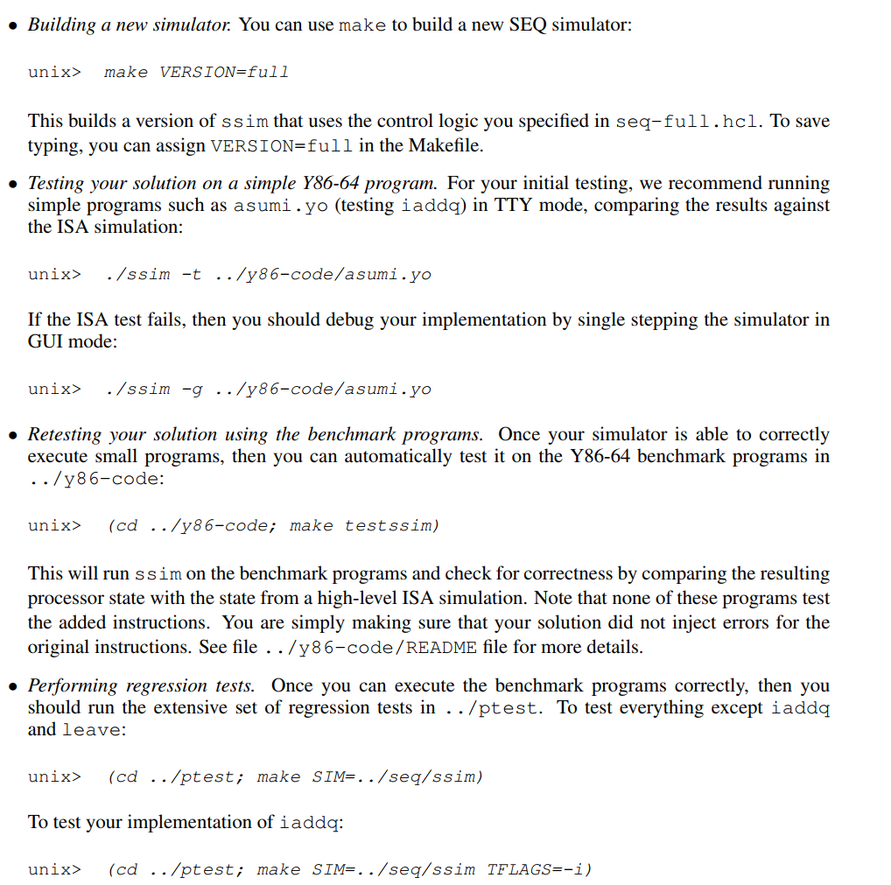
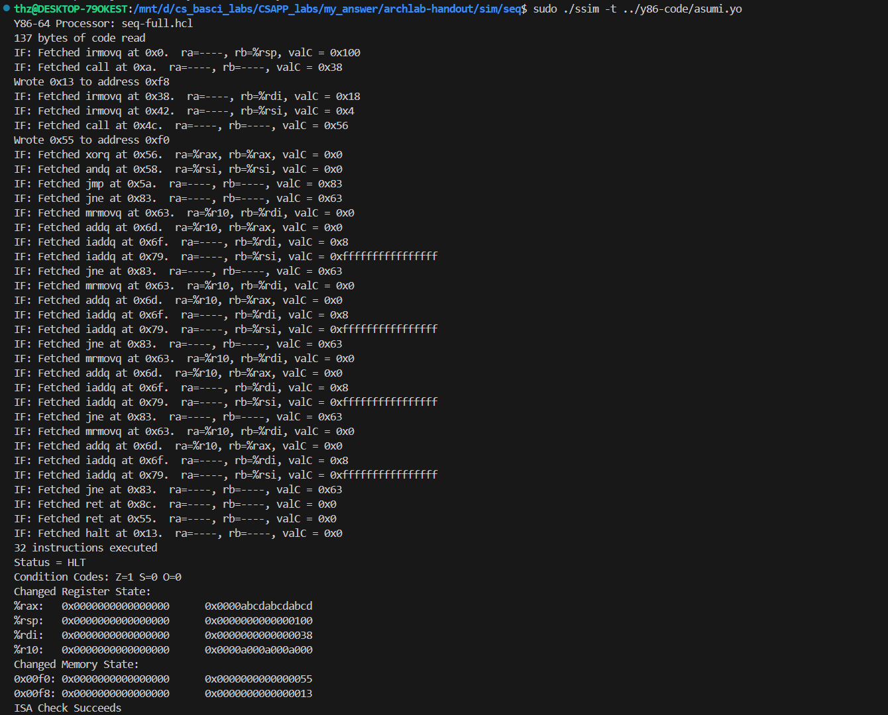
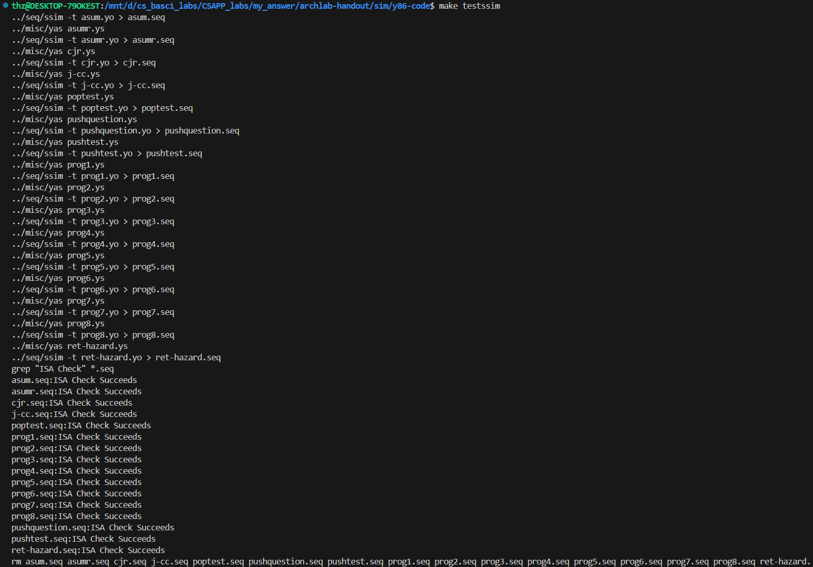
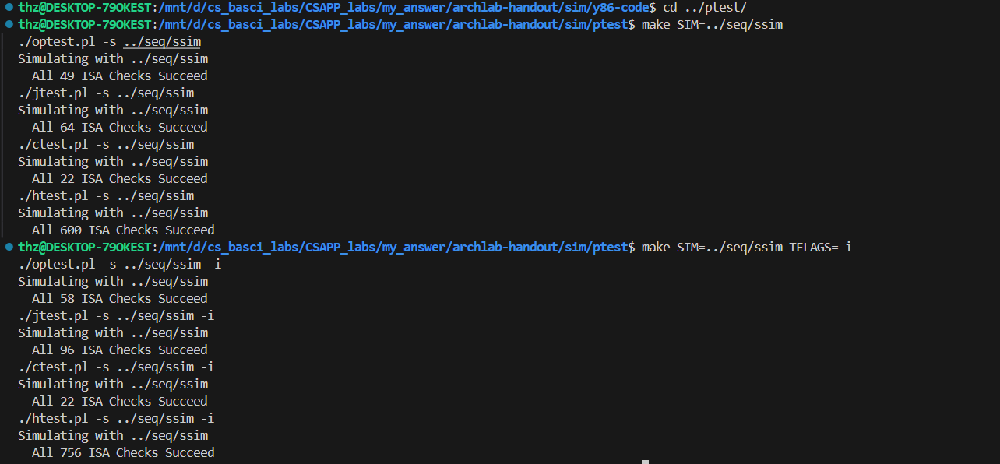

## PartA

用Y86-64的汇编指令，实现三个函数

working in directory sim/misc

链表list简单求和

链表递归求和

数组复制

该汇编和x86-64的功能相似，但更简单，其传递参数、存储局部变量、调用函数、栈帧也类似

```
/* 
 * Architecture Lab: Part A 
 * 
 * High level specs for the functions that the students will rewrite
 * in Y86-64 assembly language
 */

/* $begin examples */
/* linked list element */
typedef struct ELE {
    long val;
    struct ELE *next;
} *list_ptr;

/* sum_list - Sum the elements of a linked list */
long sum_list(list_ptr ls)
{
    long val = 0;
    while (ls) {
	val += ls->val;
	ls = ls->next;
    }
    return val;
}

/* rsum_list - Recursive version of sum_list */
long rsum_list(list_ptr ls)
{
    if (!ls)
	return 0;
    else {
	long val = ls->val;
	long rest = rsum_list(ls->next);
	return val + rest;
    }
}

/* copy_block - Copy src to dest and return xor checksum of src */
long copy_block(long *src, long *dest, long len)
{
    long result = 0;
    while (len > 0) {
	long val = *src++;
	*dest++ = val;
	result ^= val;
	len--;
    }
    return result;
}
/* $end examples */

```

#### sum_list

```
# Sample linked list
    .pos 0
    irmovq stack,%rsp
    call main
    halt

    .align 8
ele1:
    .quad 0x00a
    .quad ele2
ele2:
    .quad 0x0b0
    .quad ele3
ele3:
    .quad 0xc00
    .quad 0

main:
    irmovq ele1,%rdi
    call sum_list
    ret

sum_list:
    irmovq $0,%rax
    irmovq $8,%r8
    andq %rdi,%rdi
    jmp test

loop:
    mrmovq (%rdi),%r10
    addq %r10,%rax
    addq %r8,%rdi
    mrmovq (%rdi),%r10
    rrmovq %r10,%rdi
    andq %rdi,%rdi
    jmp test

test:
    jne loop
    ret

    .pos 0x200
stack:
```

验证：

```
thz@DESKTOP-79OKEST:/mnt/d/cs_basci_labs/CSAPP_labs/my_answer/archlab-handout/sim/misc$ ./yas sum.ys
thz@DESKTOP-79OKEST:/mnt/d/cs_basci_labs/CSAPP_labs/my_answer/archlab-handout/sim/misc$ ./yis sum.yo
Stopped in 36 steps at PC = 0x13.  Status 'HLT', CC Z=1 S=0 O=0
Changes to registers:
%rax:   0x0000000000000000      0x0000000000000cba
%rsp:   0x0000000000000000      0x0000000000000200
%r8:    0x0000000000000000      0x0000000000000008

Changes to memory:
0x01f0: 0x0000000000000000      0x000000000000005b
0x01f8: 0x0000000000000000      0x0000000000000013
```

#### rsum_list

```
# Sample linked list
    .pos 0
    irmovq stack,%rsp
    call main
    halt

    .align 8
ele1:
    .quad 0x00a
    .quad ele2
ele2:
    .quad 0x0b0
    .quad ele3
ele3:
    .quad 0xc00
    .quad 0

main:
    irmovq ele1,%rdi
    call rsum_list
    ret

rsum_list:
    andq %rdi,%rdi
    je if

else:
    pushq %rbx
    mrmovq (%rdi),%rbx
    irmovq $8,%r8
    addq %r8,%rdi
    mrmovq (%rdi),%r8
    rrmovq %r8,%rdi
    call rsum_list
    addq %rbx,%rax
    popq %rbx
    ret

if:
    irmovq $0,%rax
    ret

    .pos 0x2000
stack:
```

```
thz@DESKTOP-79OKEST:/mnt/d/cs_basci_labs/CSAPP_labs/my_answer/archlab-handout/sim/misc$ ./yas rsum.ys
thz@DESKTOP-79OKEST:/mnt/d/cs_basci_labs/CSAPP_labs/my_answer/archlab-handout/sim/misc$ ./yis rsum.yo
Stopped in 46 steps at PC = 0x13.  Status 'HLT', CC Z=0 S=0 O=0
Changes to registers:
%rax:   0x0000000000000000      0x0000000000000cba
%rsp:   0x0000000000000000      0x0000000000002000

Changes to memory:
0x1fc0: 0x0000000000000000      0x0000000000000094
0x1fc8: 0x0000000000000000      0x00000000000000b0
0x1fd0: 0x0000000000000000      0x0000000000000094
0x1fd8: 0x0000000000000000      0x000000000000000a
0x1fe0: 0x0000000000000000      0x0000000000000094
0x1ff0: 0x0000000000000000      0x000000000000005b
0x1ff8: 0x0000000000000000      0x0000000000000013
```

#### copy

```
# Sample linked list
    .pos 0
    irmovq stack,%rsp
    call main
    halt

    .align 8
# Source block
src:
    .quad 0x00a
    .quad 0x0b0
    .quad 0xc00
# Destination block
dest:
    .quad 0x111
    .quad 0x222
    .quad 0x333

main:
    irmovq src,%rdi
    irmovq dest,%rsi
    irmovq $3,%rdx
    irmovq $8,%r9
    call copy_block
    ret

copy_block:
    irmovq $0,%rax
    andq %rdx,%rdx
    je end

loop:
    mrmovq (%rdi),%r8
    xorq %r8,%rax
    rmmovq %r8,(%rsi)
    addq %r9,%rdi
    addq %r9,%rsi
    irmovq $1,%r8
    subq %r8,%rdx
    jne loop

end:
    ret

    .pos 0x2000
stack:


```

```
thz@DESKTOP-79OKEST:/mnt/d/cs_basci_labs/CSAPP_labs/my_answer/archlab-handout/sim/misc$ ./yas copy.ys
thz@DESKTOP-79OKEST:/mnt/d/cs_basci_labs/CSAPP_labs/my_answer/archlab-handout/sim/misc$ ./yis copy.yo
Stopped in 37 steps at PC = 0x13.  Status 'HLT', CC Z=1 S=0 O=0
Changes to registers:
%rax:   0x0000000000000000      0x0000000000000cba
%rsp:   0x0000000000000000      0x0000000000002000
%rsi:   0x0000000000000000      0x0000000000000048
%rdi:   0x0000000000000000      0x0000000000000030
%r8:    0x0000000000000000      0x0000000000000001
%r9:    0x0000000000000000      0x0000000000000008

Changes to memory:
0x0030: 0x0000000000000111      0x000000000000000a
0x0038: 0x0000000000000222      0x00000000000000b0
0x0040: 0x0000000000000333      0x0000000000000c00
0x1ff0: 0x0000000000000000      0x0000000000000079
0x1ff8: 0x0000000000000000      0x0000000000000013
```

==%rax的最终值为0xcba==

## PartB

working in directory sim/seq   

要求：modify the file seq-full.hcl,  extend the SEQ processor to support the iaddq  

### 回顾指令被执行时需要的六个阶段

+ 取指：获取icode:ifun，获取rA:rB，valC，valP
+ 译码：从寄存器文件获取valA,valB
+ 执行：计算得到valE（要么是算数运算 逻辑运算 要么是计算内存地址[rmmovq rA,D(rB)] 要么是计算栈指针）；有时还设置条件码
+ 访存：读（valM）或者是写内存
+ 写回：写寄存器文件
+ 更新PC

#### iaddq 

常数 IADDQ 的声明为C 

```iaddq  V,rB    //编码   C 0 F rB V```

```
//------------取指--------
icode:fun <- M[PC]
rA:rB <- M[PC+1]
valC <- M[PC+2]
valP -<PC+10
//------------译码---------
valB<- R[rB]
//-----------执行---------
valE <- valB+valC
set CC
//------------访存--------
//------------写回--------
R[rB] <- valE
//------------更新PC------
PC <- valP

```

修改hcl文件比较简单，根据iaddq的执行阶段，在特定阶段的HCL语言加上IIADDQ即可

#### 测试 

然后安装下面要求进行测试










## PartC

